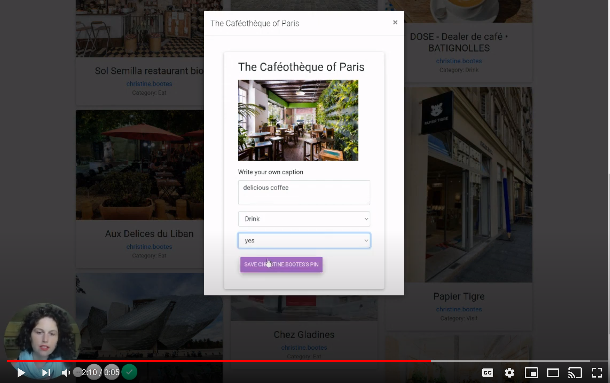

# Paris-Passe-Partout : Full Stack (React, C#)

Paris-Passe-Partout is a social media, travel web app, created for lovers of Paris to curate and keep track of their favorite places in the city while also following and saving others' recommendations and itineraries. It's a vetted, curated Google Maps, travel guide blog, Pinterest and Instagram in one.

## Watch demo of website by clicking below: 

## Technologies

Paris-Passe-Partout is built in .NET Core with C#. Entity Framework and ADO.NET Core are utilized for communicating with the SQL Server database.
The front-end is built using React and Bootstrap 4/Reactstrap/ MDB.
Google Places Autocomplete API is used for pulling data for each pin in Paris, Mapbox for rendering the map of Paris, Google Firebase for user authentication.
